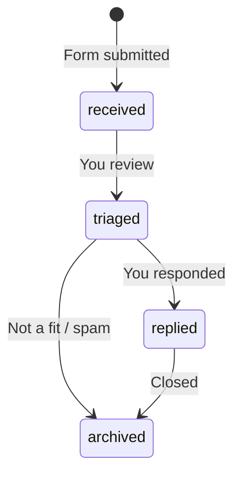

# Contact form and lead workflow

Visitors can request outreach (“I have an app to build”) through a **web form**. Submissions are processed by **AWS Lambda**, stored in **DynamoDB**, and communicated via **Amazon SES**. This design prioritizes **workflow control** over third-party form hosts.

## Product intent

### Primary audience

- Founders, teams, or engineers with a **product or platform** to build.
- Visitors who prefer a **structured message** over jumping straight to LinkedIn.

### Secondary path

Always offer a **low-friction alternative**:

- [LinkedIn](https://www.linkedin.com/in/qgjones9/) (already in site README).
- Optional visible email or mailto once a domain mailbox exists (e.g. `contact@yourdomain.com`).

### Tone and placement

- **One** dedicated **Contact** section (`#contact`), linked from the navbar.
- Optional hero CTA: “Get in touch” scrolling to the form.
- Copy should be direct: what you build (B2B tools, migrations, full-stack product work), expected response time (e.g. 2–3 business days).

## Form fields (v1)

Keep the form short to maximize completion.

| Field | Required | Purpose |
|-------|----------|---------|
| `name` | Yes | Who is reaching out |
| `email` | Yes | Reply address |
| `message` | Yes | Project context, timeline, stack (guided by placeholder) |
| `company` | No | B2B qualification |
| `website` | No | **Honeypot** — hidden from users; bots fill it → reject |

Optional later: budget/timeline dropdowns, project type aligned with gallery categories (`B2B SaaS`, `Desktop & Migrations`, `Cloud & Automation`).

**Not in v1:** phone, file uploads (spam and storage complexity).

## UX requirements

| State | Behavior |
|-------|----------|
| **Submitting** | Disable button; show loading indicator |
| **Success** | Confirm receipt; do not clear without user context |
| **Error** | Actionable message; preserve user input |
| **Accessibility** | Labels, associated errors, `type="email"`, keyboard focus |

## API contract (planned)

```http
POST https://api.yourdomain.com/contact
Content-Type: application/json
```

**Request body (example):**

```json
{
  "name": "Jane Doe",
  "email": "jane@example.com",
  "message": "We need a React dashboard for ...",
  "company": "Acme Corp",
  "website": ""
}
```

**Responses:**

| Status | Meaning |
|--------|---------|
| `201` | Lead accepted; body may include `leadId` |
| `400` | Validation failed or honeypot triggered |
| `429` | Rate limited (API Gateway / WAF) |
| `5xx` | Server error; user should retry later |

Implementation detail (handler code, IAM) is out of scope for this document; see infrastructure repo/folder when created.

## Lead workflow stages

DynamoDB is the **system of record**. Email is notification, not the database.



| Status | Meaning |
|--------|---------|
| `received` | Stored; internal notification sent |
| `triaged` | Reviewed; priority assigned (manual or rule-based later) |
| `replied` | You have responded to the submitter |
| `archived` | Closed or spam |

### Lambda responsibilities on submit

1. Validate payload (types, lengths, email format).
2. Reject if honeypot `website` is non-empty.
3. Write item to DynamoDB with `status = received` and `createdAt`.
4. Send **internal** SES email to your inbox (subject includes name; body includes fields and `leadId`).
5. Optionally send **auto-reply** SES email to submitter (template TBD).
6. Return `201` with `leadId`.

### Future workflow automation (not v1)

- EventBridge or scheduled Lambda: reminder if `received` older than N days.
- SNS to Slack for `priority = high` (when rules exist).
- Authenticated admin endpoint or script to update `status` (IAM-protected).
- Step Functions only if workflows become multi-step and branching.

## DynamoDB data model (planned)

**Table:** `Leads` (name TBD in infra)

| Attribute | Type | Notes |
|-----------|------|--------|
| `leadId` | String (PK) | UUID |
| `createdAt` | String | ISO-8601; sort key candidate |
| `status` | String | `received`, `triaged`, `replied`, `archived` |
| `name` | String | |
| `email` | String | |
| `message` | String | Max length enforced in Lambda |
| `company` | String | Optional |
| `source` | String | e.g. `portfolio-contact-form` |
| `userAgent` | String | Optional metadata |
| `ipHash` | String | Optional; store hash only if IP captured |

**GSI (optional):** `status` + `createdAt` for listing open leads.

## Amazon SES

### Domain and addresses

- Verify **sending domain** in SES (DKIM/SPF via Route 53).
- Send from address example: `contact@yourdomain.com`.
- Request **production access** early (sandbox limits sending to verified identities only).

### Email types

| Email | Recipient | Purpose |
|-------|-----------|---------|
| **Internal notification** | Your inbox | New lead alert with full detail |
| **Auto-reply** (optional) | Submitter | Acknowledgment + expectations |

Set **Reply-To** on auto-reply to the submitter’s email so you can reply from your mail client.

### Reputation

Plan SNS topics for bounces/complaints in a later hardening pass.

## Security and abuse

Public contact endpoints are expected targets for spam.

| Control | Layer |
|---------|--------|
| **CORS** | API Gateway — allow `https://yourdomain.com` (and dev `http://localhost:5173`) |
| **Rate limiting** | API Gateway throttling; optional AWS WAF |
| **Honeypot field** | Lambda rejects non-empty `website` |
| **Input validation** | Lambda — length caps, strip HTML, email format |
| **CAPTCHA** (if needed) | Cloudflare Turnstile or reCAPTCHA; verify token in Lambda |
| **No secrets in frontend** | Only public API URL in `VITE_*` |

## Why not Formspree / hosted forms

| Criterion | Hosted form SaaS | Lambda + SES + DynamoDB |
|-----------|------------------|-------------------------|
| Workflow ownership | Limited | Full control in code |
| Lead storage / status | Vendor-dependent | DynamoDB schema you own |
| AWS alignment | External | Native with site hosting |
| Operational cost | Subscription possible | Pennies at low volume |
| Time to first ship | Faster | Slower (infra setup) |

**Decision:** Accept higher initial setup for long-term control and a demonstrable AWS integration on the portfolio itself.

## Phased delivery

| Step | Deliverable |
|------|-------------|
| 1 | Contact section UI in React (can mock submit) |
| 2 | SES domain verification + production access request |
| 3 | Infra: DynamoDB table, Lambda, HTTP API, IAM roles |
| 4 | Test with `curl`; confirm email + DynamoDB write |
| 5 | Wire form to `VITE_CONTACT_API_URL`; test from localhost with CORS |
| 6 | Deploy site to S3; test from production domain |
| 7 | Auto-reply template, honeypot, optional CAPTCHA |
| 8 | Operational alarms and status-update tooling |

## Privacy

- State clearly that submitted information is used only to respond to the inquiry.
- Do not add marketing opt-in checkbox unless you operate a mailing list with consent.

## Related decisions

- [ADR-005: Lambda + SES + DynamoDB for leads](../decisions/architecture-decision-record.md#adr-005-lambda--ses--dynamodb-for-contact-leads)
- [ADR-004: API on separate subdomain](../decisions/architecture-decision-record.md#adr-004-contact-api-on-api-subdomain)
