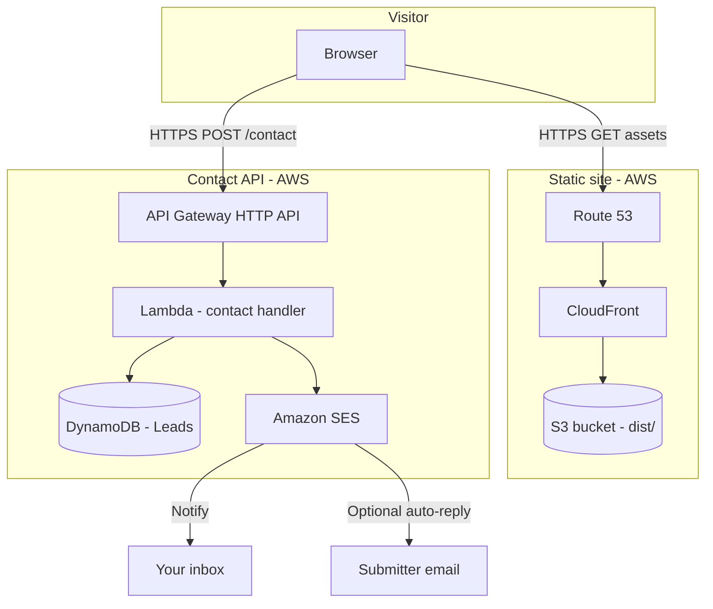

# System overview

The portfolio is a **static-first** product with a **small, API-driven contact pipeline** for inbound leads. The gallery itself does not require a server; outreach and lead management do.

## Goals

1. **Showcase work** — Project gallery, filters, and case studies driven by version-controlled content (`projects.json`).
2. **Convert visitors to conversations** — Clear “build with me” positioning, contact form, and alternate paths (LinkedIn).
3. **Own the lead workflow** — Store leads in AWS, notify via email, and evolve status/rules without a third-party form SaaS.

## High-level diagram

## Major components

| Component | Technology | Responsibility |
|-----------|------------|----------------|
| **Web app** | React 19, TypeScript, Vite, Tailwind CSS 4+ | UI, gallery, contact form client |
| **Site hosting** | S3 + CloudFront + ACM + Route 53 | Serve built `dist/` on custom domain with HTTPS |
| **Contact API** | API Gateway + Lambda | Validate submissions, run workflow, persist leads |
| **Lead store** | DynamoDB | System of record for lead records and status |
| **Email** | SES | Internal notifications and optional submitter acknowledgment |

## What we explicitly did not choose (for now)

| Alternative | Why not (initially) |
|-------------|---------------------|
| **Monorepo `frontend/` + `backend/`** | Gallery is static JSON; API is infra-as-code + Lambda, not a long-running backend server in-repo |
| **Formspree / similar** | Less control over lead schema, status workflow, and AWS-native integration |
| **FastAPI on EC2/ECS** | Higher ops surface for a single contact endpoint; Lambda fits traffic and cost profile |
| **Server-side rendering** | Not required for portfolio; static export keeps hosting simple and cheap |

## Implementation phasing

| Phase | Focus | Backend involved? |
|-------|--------|-------------------|
| **1** | Vite, Tailwind, folder structure | No |
| **2** | Types + `projects.json` | No |
| **3** | Navbar, hero, filters, project grid | No |
| **4** | Case study modal / deep views | No |
| **5** | Responsive polish, strict `npm run build` | No |
| **Contact (parallel track)** | UI stub → infra → wire API | Yes (Lambda + SES + DynamoDB) |

Contact infrastructure can be built **after** the gallery shell is deployable to S3, or in parallel once Phase 1 build pipeline is green. The UI can ship with a disabled form or mock states before the API exists.

## Cross-cutting concerns

- **Secrets** — No AWS credentials in the frontend. Public env vars only for non-secret values (e.g. API base URL). Lambda execution role holds SES and DynamoDB permissions.
- **Environments** — Plan for `dev` / `prod` API stages and matching CORS origins (localhost during development, production domain after CloudFront is live).
- **Observability** — CloudWatch Logs for Lambda; alarms on errors; optional metrics on submission volume.

## Further reading

- [Repository layout](repository-layout.md)
- [AWS hosting](hosting-aws.md)
- [Contact and leads](contact-and-leads.md)
- [Frontend stack](frontend-stack.md)
- [Architecture decision record](../decisions/architecture-decision-record.md)
